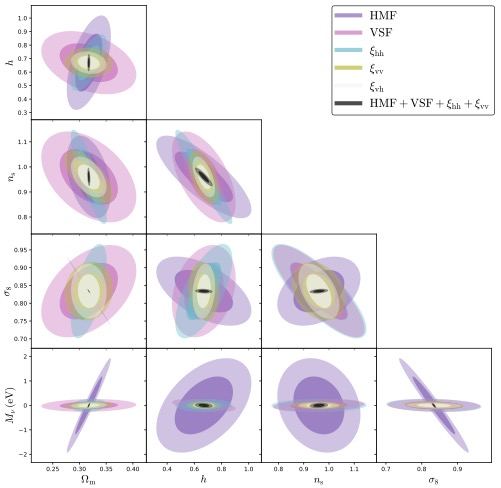
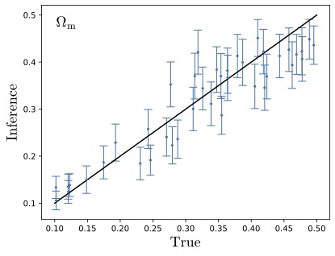
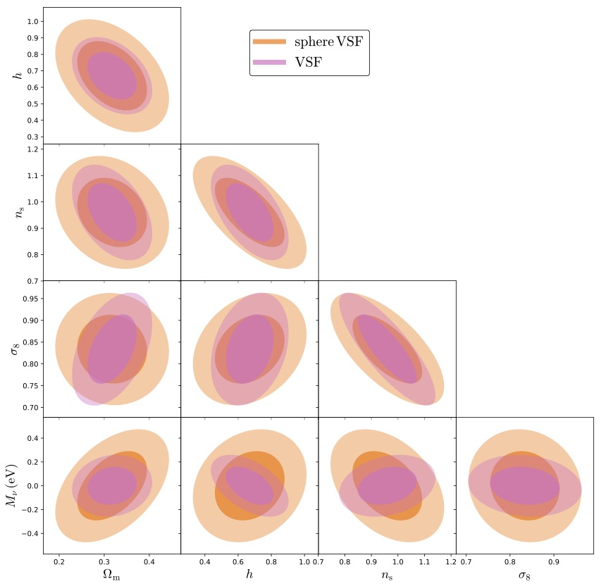

Applications
============

With the release of the GIGANTES void catalogs suite we provide some example applications (see `Kreisch et al. 2022 <https://arxiv.org/abs/2107.02304>`_). These are straightforward applications showcasing GIGANTES' power and opening the way to exciting projects to perform with GIGANTES. 

Application 1: cosmological information in void statistics
~~~~~~~~~~~~~
We aim to answer the following question: Do voids carry additional information? 
The question of whether voids, defined by relying on the halo (or galaxy) distribution, carry additional cosmological information with respect to traditional tools based on the halo (or galaxy) distribution, such as the two-point correlation function or the halo-mass function, has been a debated topic.
Relying on a Fisher forecast from the GIGANTES dataset we show that void statistics allow to constrain regions of the parameter space that would otherwise remain unconstrained. 

The figure below shows constraints on cosmological parameters from the voids (void size function, void-halo, and void-void correlation functions) and halos (halo mass function, halo auto-correlation function), and the combined power of voids and halos. 

Application 2: likelihood-free inference on the void size function 
~~~~~~~~~~~~~
This application is an example of a machine learning application to the GIGANTES dataset. Our goal is to perform likelihood-free inference from one of the most important summary statistics associated to cosmic voids: the void size function. In order to carry out this task, we need many examples from different cosmological models in order to be able to extract unique patterns that allow us to find a connection between the void size function and the value of the cosmological parameters.
The goal of this application is to predict the mean and standard deviation of the posterior from the void size function. 

Application 3: void finder sensitivity to shape adds information 
~~~~~~~~~~~~~

For this example we compare the information content captured when the void shape is measured in detail with the case in which a spherical assumption is made by the void finder. In other words we compare constraints obtained when selecting voids with VIDE, a void finder with no prior on void shape, and a more simplistic spherical-assumption based void finder.

For most of the cosmological parameters considered in this paper the void size function measured by VIDE provides more stringent constraints than the void size function measured by the spherical void finder.

These results showcase for the first time that even for non-shape based applications, such as the void size function, shape plays a strong role in determining the quality of constraints.

The large number of void catalogs in GIGANTES allows many other scientific applications. 
