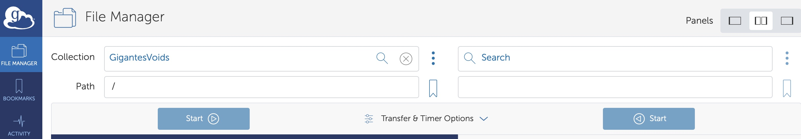
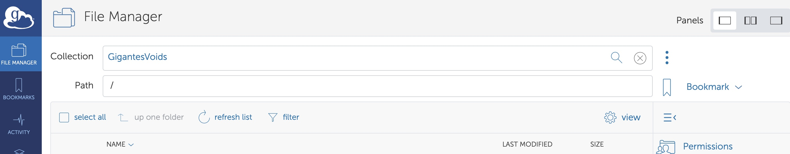

Data
====

Description
~~~~~~~~~~~

Void catalogs: Gigantes includes 15,000 VIDE fiducial cosmology void catalogs, as well as over 9,000 catalogs in non-fiducial cosmologies, spanning various values of the following cosmological parameters :math:`\Omega_{\rm m}`, :math:`\Omega_{\rm b}`, :math:`h`, :math:`n_s`, :math:`\sigma_8`, :math:`M_\nu`, and fully leveraging the QUIJOTE simulation suite, which covers redshifts z = 0.0, 0.5, 1.0, and 2 in real- and redshift-space. 

Void finder: The void finding relies on the popular public void finder VIDE (`Sutter et al. 2015b<https://arxiv.org/abs/1406.1191>`__), arguably the most used void finder, as testified by its use in a plethora of papers performing both simulation-based theoretical modelling and data analysis from modern surveys (`Papers using VIDE<http://bitbucket.org/cosmicvoids/vide_public/wiki/Papers%20Using%20VIDE>`__).

Information about VIDE, used to build GIGANTES can be found here : `VIDE Wiki<https://bitbucket.org/cosmicvoids/vide_public/wiki/Home>`__ . 

Provided statistics:
Void center position (x,y,z---this is the volume-weigthed center, a.k.a. macrocenter), Void effective radius (Mpc/h), Void ID, void volume, redshift, ellipticity, density contrast, number of children (sub-voids), central density ...

Download
~~~~~~~~
The data can be accessed through `globus <https://www.globus.org/>`__:

- Log in into `globus <https://www.globus.org/>`__ (create an account if you dont have one).
- To **access** the data, type: Gigantes (or with this `link <https://app.globus.org/>`_).

- To **transfer** the data, the simplest way is to use the globus graphical environment. Just type the above names in collection (Gigantes) or click the associated link. You will need to choose where the data is being moved in the other collection (e.g. your laptop or another supercomputer). Once the collection points are set, select the data you want to transfer and destiny folder and click in Start.

Note that to download the data to your local machine (e.g. laptop) you will need to install the globus connect personal. 

Organization
~~~~~~~~~~~~

The GIGANTES data is organized in different folders:

[Details about folder]

Each void catalog has the following structure (VIDE void catalog structure):
sample_info.txt: Small text file which lists some basic info of the sample

zobov_slice_[sample_name].dat: Binary file with the galaxy positions, RA, Dec, redshift, and unique catalog ID. Note that this file contains all particles in the particular sample, not just void particles.

voidDesc_[all,central]_[sample_name].out: ASCII file with void indices and basic void properties in ZOBOV-normalized units.

voidZone_[sample_name].out: Binary file which links voids to zones.

voidPart_[sample_name].out: Binary file which links zones to particles.

vol_[sample_name].out: Binary file with particle local volumes

In addition, VIDE provides the following derived void information:

 -centers_[all, central]_[sample_name].txt: ASCII file with void centers, volume, effective radius, void ID, density contrast, etc.
 -sky_positions_[all, central]_[sample_name].txt: ASCII file with void RA, dec, effective radius, and void ID
 -shapes_[all, central]_[sample_name].txt: ASCII file with best-fit eigenvalues and eigenvectors for each void, in same coordinate system as x,y,z values in centers file

In addition to the [all,central] version of each file above, there are four versions of each catalog:

 -no prefix: only parent voids, density cut applied (default catalog)
 -untrimmed: all voids in hierarchy, density cut not applied
 -untrimmed_dencut: all voids in hierarchy, density cut applied [deprecated]
 -trimmed_nodencut: only parent voids, density cut not applied [deprecated]

