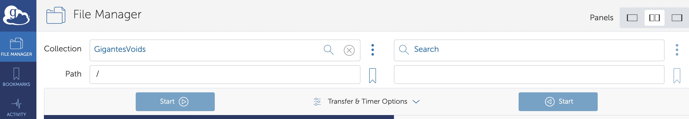
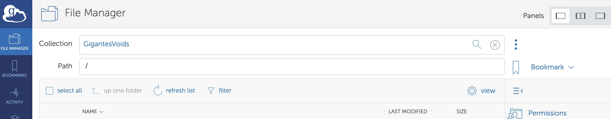

Download
========

The data can be accessed through `globus <https://www.globus.org/>`__:

- Log in into `globus <https://www.globus.org/>`__ (create an account if you dont have one).
- To **access** the data, type: GigantesVoids (or with this `link <https://app.globus.org/file-manager?origin_id=63e824d8-e5f7-485d-9941-45fd671cf432&path=%2F>`_).

- To **transfer** the data, the simplest way is to use the globus graphical environment. Just type the above names in collection (Gigantes) or click the associated link. You will need to choose where the data is being moved in the other collection (e.g. your laptop or another supercomputer). Once the collection points are set, select the data you want to transfer and destiny folder and click in Start.

Note that to download the data to your local machine (e.g. laptop) you will need to install the globus connect personal.

