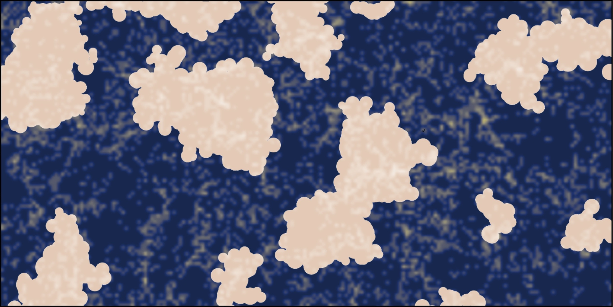

.. gigantes documentation master file, created by
   sphinx-quickstart on Fri Jun 18 16:52:37 2021.
   You can adapt this file completely to your liking, but it should at least
   contain the root `toctree` directive.

Gigantes
====================================
Gigantes is the most extensive and realistic void catalog suite ever released, containing over 1 billion cosmic voids covering a volume larger than the observable Universe, more than 20 TB of data, and created by running the void finder VIDE on the halos from the `Quijote simulations <https://quijote-simulations.readthedocs.io/en/latest/index.html>`_. 
Gigantes provides the tools for intensive machine learning exploration of void statistics.

.. toctree::
   :maxdepth: 2
   :caption: Science

   Goals
   Publications
   Applications

.. toctree::
   :maxdepth: 2
   :caption: Data
   
   Description
   Download
   Organization

.. toctree::
   :maxdepth: 2
   :caption: Other

   Team
   Citation
   License
   Help

